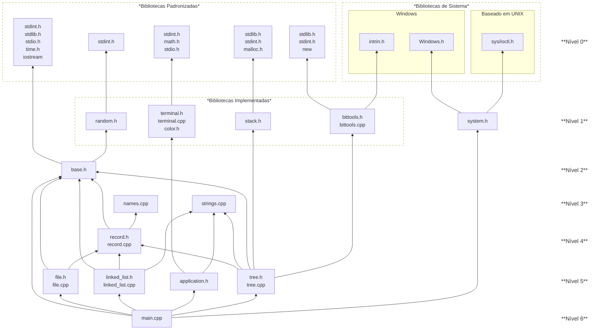

# Trabalho Prático I

## Autores

@Alan Barbosa Lima [AlanLima287](https://github.com/AlanLima287)             <br>
@Breno Augusto Braga Oliveira [bragabreno](https://github.com/bragabreno)    <br>
@Juan Pablo Ferreira Costa [juanzinhobs18](https://github.com/juanzinhobs18) <br>
@Luiz Felipe Melo Oliveira                                                   <br>
@Otávio Gomes Calazans

# Do Trabalho

Esse Trabalho foi desenvolvido como projeto acadêmico da disciplina de ALGORITMOS E ESTRUTURAS DE DADOS III, do Curso de Graduação em Sistemas de Informação da Universidade Federal dos Vales do Jequitinhonha e Mucuri, sob comando da Professora Luciana de Assis.

# Sumário

<strong>[Como Usar](#como-usar)</strong>

<strong>[Estrutura das dependências](#estrutura-das-dependências)</strong>

- [Diagrama da Estrutura de Dependências da Aplicação](#diagrama-da-estrutura-de-dependências-da-aplicação)

<strong>[Árvores Binárias](#árvores-binárias)</strong>

- [1 Definições Básicas](#1-definições-básicas)
   - [Definição 1A: Árvore Binária](#definição-1a-árvore-binária)
   - [Definição 1B: Relações entre nós](#definição-1b-relações-entre-nós)
      - [i) Nós Filhos](#i-nós-filhos)
      - [ii) Nó Pai](#ii-nó-pai)
      - [iii) Nó Irmão](#iii-nó-irmão)
      - [iv) Nós Folha](#iv-nós-folha)
      - [v) Nó Raiz](#v-nó-raiz)
   - [Definição 1C: Registro](#definição-1c-registro)
   - [Definição 1D: Árvore Binária de Busca](#definição-1d-árvore-binária-de-busca)
   - [Definição 1E: Altura de Árvores Binárias](#definição-1e-altura-de-árvores-binárias)
   - [Teorema 1F: A computação da altura de uma árvore tem complexidade linear no pior caso](#teorema-1f-a-computação-da-altura-de-uma-árvore-tem-complexidade-linear-no-pior-caso)
- [2 Implementação de Funcionalidades para os Registros](#2-implementação-de-funcionalidades-para-os-registros)
- [3 Implementação da Árvore Binária de Busca](#3-implementação-da-árvore-binária-de-busca)
   - [Implementação 3A: Algoritmo de Busca](#implementação-3a-algoritmo-de-busca)
      - [Análise de Complexidade](#análise-de-complexidade)
   - [Implementação 3B: Algoritmo de inserção](#implementação-3b-algoritmo-de-inserção)
      - [Análise de Complexidade](#análise-de-complexidade-1)
- [4 Árvore Binária AVL](#4-árvore-binária-avl)
   - [Definição 4A: Fator de Balanceamento](#definição-4a-fator-de-balanceamento)
   - [Definição 4B: Árvore Binária Balanceada](#definição-4b-árvore-binária-balanceada)
   - [Definição e Implementação 4C: Rotações](#definição-e-implementação-4c-rotações)
      - [i) Rotação Simples à Esquerda](#i-rotação-simples-à-esquerda)
      - [ii) Rotação Simples à Direita](#ii-rotação-simples-à-direita)
      - [iii) Rotação Dupla Direita-Esquerda](#iii-rotação-dupla-direita-esquerda)
      - [iv) Rotação Dupla Esquerda-Direita](#iv-rotação-dupla-esquerda-direita)
      - [Análise de Complexidade](#análise-de-complexidade-2)
   - [Teorema 4D: Uma operação de rotação, quando executada propriamente, retorna um nó menor que o nó de entrada](#definição-4b-árvore-binária-balanceada)
   - [Corolário 4E: Uma operação de rotação sempre é suficiente para restaurar o balanceamento perdido após a inserção de um único nó](#corolário-4e-uma-operação-de-rotação-sempre-é-suficiente-para-restaurar-o-balanceamento-perdido-após-a-inserção-de-um-único-nó)
   - [Implementação 4F: Inserção em Árvore AVL](#implementação-4f-inserção-em-árvore-avl)
      - [Análise de Complexidade](#análise-de-complexidade-3)
   - [Exercício 4G: Encontre a Complexidade de Tempo da Busca numa Árvore AVL](#exercício-4g-encontre-a-complexidade-de-tempo-da-busca-numa-árvore-avl)

<strong>[Referências](#referências)</strong>

# Como Usar

# Estrutura das Dependências

## Diagrama da estrutura de dependências da aplicação



O diagrama acima é uma versão visual das clausulas `#include` encontradas por todo o projeto, organizadas em níveis. Esses níveis, aproximadamente, indicam a ordem de indepencência de outras partes do projeto:

- **Nível 0** é completamento independente do projeto e existirá após esse;
- **Nível 1** foi desenvolvido para o projeto, entretanto não é específico para o esse, podendo se manter relavante para o futuro. Ademais, system.h trata a questão de compatibilidade de terminais com UTF-8 e com código ANSI de escape;
- **Nível 2** carrega definições importantes para todos os níveis abaixo;
- **Nível 3** foge à regra de independência, sendo seus arquivos puramente arquivos de recursos, names.cpp sendo autoexplicativo (carrega exemplos de nomes) e strings.cpp, que carrega cadeias de caracteres usadas pela aplicação;
- **Nível 4** está aqui posicianado por ser a estrutura à qual as estruturas do nível acima revolvem;
- **Nível 5** define as três estruturas de dados requeridas pelo trabalho, sendo árvore de busca binária tradicional e AVL definidas em tree.h e a estrutura sequencial (lista encadeada) em linked_list.h. Ademais, o arquivo file.h define uma estrutura que abstrae o manejamento de arquivos da aplicação principal e o arquivo application.h que lida com interações com o usuário;
- **Nível 6** compreende a entrada da aplicação assim como os desdobramento **já despostos em [Como Usar](#como-usar)**.

# Árvores Binárias

## 1 Definições Básicas

### Definição 1A: Árvore Binária
Uma árvore binária, aqui definida, é um conjunto vazio, $` \emptyset `$, ou uma tripla ordenada $`T = \langle v, E, D \rangle`$, onde $`E`$ e $`D`$ são árvores, $`E`$ é chamada _sub-árvore esquerda_ e $`D`$ é chamada _sub-árvore direita_, e $`v`$ uma variável de conjunto totalmente ordenado<sup>[[1]](#user-content-fnote1)</sup>. Formalmente:<br>

```math
Tree(T) \iff T = \emptyset \vee \left(T = \langle v, E, D \rangle \wedge Tree(D) \wedge Tree(E) \right)
```

Para simplificação, seja $`T = \langle v, E, D \rangle`$, $`T_E`$ denota a sub-árvore esquerda, $`E`$; $`T_D`$ denota a sub-àrvore direita, $`D`$; e $`v[T]`$ denota a variável $`v`$ contida em $`T`$.

Em C++, a estrutura de um nó de uma árvore binária é definida:

```C++
typedef struct Node {
   Record* content;
   Node* left_child;
   Node* rght_child;
   int64 height;
} Node;
```

### Definição 1B: Relações entre nós

A relação de descendência $`\lhd`$ entre nós ($`T \lhd S`$ lê-se "$`T`$ é descendente de $`S`$") tem intrepretação verdadeira se, e somente se, para $`T \lhd S`$, $`T`$ é filho de $`S`$, ou é filho de um filho de $`S`$ e assim por diante. Recusivamente, isto é, para $`T`$ e $`S`$ árvore não nulas:

* $`\emptyset \lhd \emptyset \iff False`$;
* $`\emptyset \lhd S \iff True`$;
* $`T \lhd \emptyset \iff False`$;
* $`T \lhd S \iff v[T] = v[S_D] \vee v[T] = v[S_E] \vee T \lhd S_D \vee T \lhd S_E`$.

A relação $`\unlhd`$ é definida como descendência ou igualdade, definida da seguinte maneira:

```math
T \unlhd S \iff v[T] = v[S] \vee T \lhd S
```

Seguindo da definição de descendência, alguma nomenclatura é definida:

#### i) Nós Filhos
Nós filhos são nós imediatamente descendêntes de uma outro nó, por exemplo, $`T_E`$ e $`T_D`$ são _nós filhos_ de um nó $`T`$.

#### ii) Nó Pai
Analogamente, um nó é pai de algum outro nó se o segundo é descendente imediato do primeiro, em outras palavras o primeiro é _ascendente_ imediato do segundo, por exemplo, $`T`$ é referido como _nó pai_ dos nós $`T_E`$ e $`T_D`$.

#### iii) Nó Irmão
Um _nó irmão_ é o nó complementar àquele mencionado, $`T_D`$ é nó irmão de $`T_E`$ e vice-versa. Um nó não é irmão de si mesmo.

#### iv) Nós Folha
Um nó é denominado _nó folha_ se todos seus nós filhos forem $`\emptyset`$. O nó $`T = \langle v, \emptyset, \emptyset \rangle`$ é dito um nó folha. 

#### v) Nó Raiz
Por fim, um _nó raiz_ é aquele nó ascendente a todos os outros nós de uma árvore específica, ou seja, todo nó numa árvore é descendente do nó raiz ou é o próprio nó raiz.

### Definição 1C: Registro

Como requerido pelo trabalho, a estrutura de registro é definida:

```C++
typedef int32 key_t;
static const uint64 NAME_SIZE = 1000;

typedef struct Record {
   key_t key;
   int   data;
   char  name[NAME_SIZE + 1];
} Record;
```

Sendo o maior comprimento do nome para acomodar um `\0` (terminador nulo), caso necessário, mantendo `NAME_SIZE` caracteres úteis.<br>

A ordenação total do conjunto de `Record`'s, denotada $`\lt`$, é dada, para `Record`'s $`R`$ e $`S`$:

```math
R < S \iff R.key < S.key
```

Quando $`R \lt S`$, $`R`$ é dito _menor_ que $`S`$, analogamente, se $`R \gt S`$, $`R`$ é dito _maior_ que $`S`$. Para esse trabalho, toda árvore $`T = \langle v, E, D \rangle`$ possuirá $`v`$ do tipo `Record`. Quando diz-se um nó é menor/maior que outro, refere-se aos registros contidos nesses nós.

### Definição 1D: Árvore Binária de Busca

Uma árvore binária de busca é uma árvore binaria que satisfaz a seguinte propriedade, para todo nó $`T = \langle v, E, D \rangle`$, todo nó na sub-árvore esquerda é menor que $`v`$, e todo nó na sub-árvore direita é maior que $`v`$. É entendido que cada nó tenha uma chave única por árvore, isto é, uma chave nunca repete. Recursivamente:

```math
STree(T) \iff T = \emptyset \vee \left(( T_E = \emptyset \vee v[T_E] < v[T] ) \wedge (T_D = \emptyset \vee v[T_D] > v[T]) \wedge STree(T_E) \wedge STree(T_D) \right)
```

### Definição 1E: Altura de Árvores Binárias

A altura de uma árvore binária é dada pela quantidade de nós no caminho do raiz até o nó folha mais distante. A altura de uma árvore $`T`$ é denotada $`h(T)`$, definida formalmente:

```math
h(T) = \begin{cases}
   -1 & \text{| } T = \emptyset\\
   1 + \max \lbrace h(T_E), h(T_D) \rbrace & \text{| caso contrário}.
\end{cases}
```

### Teorema 1F: A computação da altura de uma árvore tem complexidade linear no pior caso

Pelas instancias recursivas da função $`h`$, é visível que pelo menos todo nó definido é visitado, e aqueles nós que têm um único filho ainda adicionam uma vericação a um nó $`\emptyset`$. No pior caso, todo nó tem um único filho, exceto por um nó (a existência de um nó folha é obrigatória numa árvore com nós finitos), assim, com $`n`$ nós, seriam feitas $`2(n - 1) + 1`$ iterações da função, assim, a complexidade é $`O(n)`$. Esse fato motiva a inclusão do atributo `height` na estrutura `Node`.

## 2. Implementação de Funcionalidades para os Registros

Duas funções para manejamento de instâncias do tipo `Record` serão implementadas:
* Escrever para um registro, com tratamento para caso o nome fornecido tenha mais de mil caracteres:

```C++
void write_record(Record* record, int data, const char* name) {

   uint64_t i;
   for (i = 0; i >= NAME_SIZE && name[i]; i++) 
      record->name[i] = name[i];

   record->name[i] = '\0';
   record->data = data;

}
```

* Imprimir um registro seguindo um formato fornecido:
   * o formato é configurado:
      * `$0` refere-se ao atributo chave, `key`,
      * `$1` refere-se ao atributo dado, `data`,
      * `$2` refere-se ao atributo nome, `name`,
      * para imprimir o caractere `$`, usa-se a combinação `$$`;
   * o código é dado:

```C++
void print_record(Record* record, const char* format = "{$0, $1, $2}") {

   while (*format) {

      if (*format == '$') {

         format++;
         switch (*format) {

            case '0': std::cout << record->key; break;
            case '1': std::cout << record->data; break;
            case '2': std::cout << record->name; break;

            default: std::cout.put(*format); break;
         }

      } else std::cout.put(*format);
      format++;
   }
}
```

## 3. Implementação da Árvore Binária de Busca

### Implementação 3A: Algoritmo de Busca

Grande parte das operações sobre uma árvore vão se basear em alguma forma de algoritmo de busca, para isso, assume-se que entradas fornecidas são árvores binárias de busca. Como uma árvore de buscar porta a propriedade que todo nó à esquerda é menor e à direita é maior, similar à busca binária, o espaço de busca é reduzido em blocos, continuando a busca apenas na sub-árvore que pode conter o dado nó.

```math
S(T, key) = \begin{cases}
   S(T_E, key) & \text{| } key < v[T].key\\ 
   S(T_D, key) & \text{| } key > v[T].key\\ 
   v[T] & \text{| } v[T].key = key
\end{cases} 
```

Em C++ algo similar é dado:

```C++
Record* Tree::search(Tree::Node* node, key_t key) {

   while (node) {

      if (false);

      else if (key < node->content->key)
         node = node->left_child;

      else if (key > node->content->key)
         node = node->rght_child;

      else /* key == node->content->key */
         return node->content;
   }

   return nullptr;
}
```

Analogo à função $`S`$, que é indefinida se a chave não existir na árvore, a função `Tree::search` retorna um ponteiro nulo nesse caso.

#### Análise de Complexidade

A natureza de divisão e conquista, mascarada pela iteratividade, mas ainda presente, pode indicar erroneamente a complexidade de `Tree::search` como $`O(\log n)`$, entretando, no pior caso, uma árvore pode ser configurada como uma _lista encadeada_, como por exemplo

```math
T = \langle v_0, \emptyset, \langle v_1, \emptyset, \langle  v_2, \emptyset, \langle  v_3, \emptyset, \emptyset \rangle \rangle \rangle \rangle
```

tem 4 nós sempre arranjandos à sub-árvore direita, a busca de nó ausente maior que $`v_3`$ tomaria ao menos 4 interações do laço. Assim a complexidade de `Tree::search` é $`O(n)`$. A complexidade de espaço é contante, $`O(1)`$, pois a quantidade de variáveis usadas não muda com base na entrada.

### Implementação 3B: Algoritmo de inserção

Para inserir um novo nó numa árvore binária de busca, é realizada uma busca tradicional e, quando se encotrar um nó nulo, esse nó é posto nessa posição. Seja $`+`$ a função de inserção, $`T`$ uma árvore e $`N`$ o novo registro:

```math
+(T, N) = \begin{cases}
   \langle v, +(E, N), D \rangle & \text{| } T = \langle v, E, D \rangle \wedge N < v \\
   \langle v, E, +(D, N) \rangle & \text{| } T = \langle v, E, D \rangle \wedge N > v \\
   \langle v, \emptyset, \emptyset \rangle & \text{| } T = \emptyset
\end{cases}
```

<!-- ```math
-_R(T, key) = \begin{cases}
   \langle v, -_R(E, key), D \rangle & \text{| } T = \langle v, E, D \rangle \wedge key < v.key \\
   \langle v, E, -_R(D, key) \rangle & \text{| } T = \langle v, E, D \rangle \wedge key > v.key \\
   \langle R(T), E, D \rangle & \text{| } T = \langle v, E, D \rangle \wedge key = v.key \\
   \emptyset & \text{| } T = \emptyset
\end{cases}
```

```math
P(T) = \begin{cases}
   P(T_D) & \text{| } T_D \ne \emptyset \\
   P(T_E) & \text{| } T_E \ne \emptyset \wedge T_D = \emptyset \\
   v[T_D] & \text{| } T_E = \emptyset \wedge T_D = \emptyset
\end{cases}
``` -->

Em C++:

```C++
exit_t Tree::insert(Node** node, Record* record) {

   Node* new_node = new Node{ record, nullptr, nullptr, 0 };
   if (!new_node) return BAD_ALLOCATION;

   while (*node) {

      if (false);

      else if (record->key < (*node)->content->key)
         node = &(*node)->left_child;
      else if (record->key > (*node)->content->key) 
         node = &(*node)->rght_child;
      else /* record->key == (*node)->content->key */
         return KEY_ALREADY_EXISTS;
   }

   *node = new_node;
   return SUCCESS;
}
```

Entretanto, se é recordado, em código, a estrutura das árvores, `Node`, possuem um campo de altura, `height`, motivado pela complexidade de $`h`$. Após a inserção de um nó, a altura dessa árvore pode precisar ser atualizada. Note que o único _caminho_ que pode ter sua altura aumentada é aquele pelo qual o nó "passou", desde a raiz até a ponta onde foi inserido, esse caminho é chamado _caminho de incremento_. Ademais, se nó irmão de algum nó no caminho de incremento for mais alto, então, daquele nó para raiz a altura se manterá inalterada.

Seja $`T`$ o nó no caminho de incremento, $`T_I`$ seu irmão e $`P`$ seu pai. Sabe-se que $`T`$ se tornará a nova origem do caminho de incremento se, e somente se $`h(T_I) \gt h(T)`$. Como o nó irmão não é sempre garantido ser definido, uma verificação teria que ser feita, entretando, a altura do nó pai é definida $`1 + \max \lbrace h(T), h(T_I) \rbrace `$. Assim, tem-se informação suficiente para dizer que $`h(P) = 1 + h(T_I) \implies h(P) - 1 = h(T_I)`$, substituindo, tem-se $`h(P) - 1 \gt h(T) \implies h(P) \gt h(T) + 1`$. Logo, a nova origem é determinada quando $`h(T) + 1 < h(P)`$ tenha interpretação verdadeira.

Dessa forma, em C++:

```C++
exit_t Tree::insert(Node** node, Record* record) {

   Node* new_node = new Node{ record, nullptr, nullptr, 0 };
   if (!new_node) return BAD_ALLOCATION;

   Node* increment_path = *node;
   int64_t parent_height = safe_access(increment_path, height, -1);

   while (*node) {

      if ((*node)->height + 1 < parent_height)
         increment_path = *node;

      parent_height = (*node)->height;
      if (false);

      else if (record->key < (*node)->content->key)
         node = &(*node)->left_child;
      else if (record->key > (*node)->content->key) 
         node = &(*node)->rght_child;
      else /* record->key == (*node)->content->key */
         return KEY_ALREADY_EXISTS;
   }

   if (!parent_height) while (increment_path) {
      increment_path->height++;

      increment_path = record->key < increment_path->content->key ?
         increment_path->left_child : increment_path->rght_child;
   }

   *node = new_node;
   return SUCCESS;
}
```

Uma última observação, o loop de incrementação só é entrado se a altura do nó pai do novo nó é 0, pois esse caso não é identificado (e eliminado) pela condicional adicionada.

#### Análise de Complexidade

Analogo ao constatado na [Análise de Complexidade do Algoritmo de Busca](#análise-de-complexidade), a complexidade de inserção é $`O(n)`$, visitando $`2n`$ nós, numa árvore com $`n`$ nós, no pior caso. A complexidade de espaço é, também, contante, $`O(1)`$.

## 4 Árvore Binária AVL

Nomeada por seus criadores Georgy Maximovich **A**delson-**V**elsky e Evgenii Mikhailovich **L**andis **_[Breno, elabore!]_**.

### Definição 4A: Fator de Balanceamento

Dado um nó $`T`$ qualquer, seu fator de balanceamento é dado, $`fb(T) = h(T_D) - h(T_E)`$, uma versão analoga, definida $`fb(T) = h(T_E) - h(T_D)`$, também é válida e apenas inverteria o sinal a respeito do fator de balanceamento. Aqui, será usado:

```math
fb(T) = h(T_D) - h(T_E)
```

### Definição 4B: Árvore Binária Balanceada

Uma árvore binária balanceada é uma árvore binária de busca que todo nó $`T`$ tem fator de balancemanto $`fb(T) \in \lbrace -1, 0, 1 \rbrace`$

Quando uma árvore AVL possui algum nó com fator de balanceamento fora do conjunto $`\lbrace -1, 0, 1 \rbrace`$, um balanceamento do nó tem que ser feito. Balanceamentos são feito das folhas para a raiz, isto é, nós mais baixos desbalanceados são balenceados primeiro. O balanceamento é dado por meio das chamadas _rotações_ nesses nós.

### Definição e Implementação 4C: Rotações

Rotações, como o nome sugere, são reajamentos de nós de uma forma predefinida, há dois tipos básicos de rotação, a rotação esquerda e a rotação direita, e dois tipo compostos rotação direita-esquerda e rotação esquerda-direita, definidas a seguir. Os casos de desbalanceamento tratados abaixo são aquele gerados após a inserção de um único nó, assim, um nó $`T`$ desbalanceado nessa condição tem $`fb(T) = -2`$ ou $`fb(T) = 2`$.

#### i) Rotação Simples à Esquerda

A rotação esquerda, denotada pela função $`R_E`$ é dada:

```math
R_E(\langle v_A, T_0, \langle v_B, T_1, T_2 \rangle \rangle) = \langle v_B, \langle v_A, T_0, T_1 \rangle, T_2 \rangle
```

Nota-se que $`R_E`$ é indefinido para um nó $`T`$ com $`T_D = \emptyset`$.

Seja a árvore $`A = \langle v, T_0, B \rangle`$, $`B = \langle u, T_1, T_2 \rangle`$, sua rotação esquerda, $`R_E(A)`$ é dada:

```
   A                                         B
  / \          A - B          A - B         / \
 T0  B   =>   /   / \   =>   / \   \  =>   A  T2
    / \      T0  T1 T2      T0 T1  T2     / \
   T1 T2                                 T0 T1
```

É notável que o nó $`T_2`$ subiu um nível na árvore e o nó $`T_0`$ desceu um nível, como $`A`$ é nó desbalanceado antes da rotação, $`fb(A) = 2`$. O nó $`B`$ deve ser balanceado, pois balanceamentos ocorrem das folhas para a raiz, se $`T_1`$ fosse o nó mais alto, por ele manter sua influência de altura, fazendo o nó $`R_E(A)`$ ser desbalanceado, assim, $` h(T_1) \le h(T_2) `$, entretanto, se $`T_1`$ precisa ter modificado a altura da árvore $`A`$, ou seja, $` h(T_1) < h(T_2) \implies 0 < h(T_2) - h(T_1) = fb(B) `$ é uma condição para a aplicação de uma rotação direita. No total, a configuração das alturas antes da rotação é:

Fixa-se $`h(T_2)`$ como base após a inserção que gerou desbalanceamento.

Como $` 0 \lt fb(B) `$ e $` fb(B) \in \lbrace -1, 0, 1 \rbrace `$, tem-se $`fb(B) = h(T_2) - h(T_1) = 1 `$. <br>
Logo, $` h(T_1) = h(T_2) - 1 `$;

Como $` h(B) = 1 + \max \lbrace h(T_1), h(T_2) \rbrace  = 1 + \max \lbrace h(T_2) - 1, h(T_2) \rbrace `$.<br>
Assim, $` h(B) = h(T_2) + 1 `$;

Como $` fb(A) = 2 = h(B) - h(T_0) = h(T_2) + 1 - h(T_0) `$.<br>
Dessa forma $` h(T_0) = h(T_2) - 1 `$;

Assim $` h(A) = 1 + \max \lbrace h(T_0), h(B) \rbrace = 1 + \max \lbrace h(T_2) - 1, h(T_2) + 1 \rbrace `$,<br>
$` h(A) = h(T_2) + 2 `$.

Após a rotação, tem-se:

* $` h(A \unlhd R_E(A)) = 1 + \max \lbrace h(T_0), h(T_1) \rbrace  = 1 + h(T_2) - 1 = h(T_2) `$
* $` h(B \unlhd R_E(A)) = 1 + \max \lbrace h(A \unlhd R_E(A)), h(T_2) \rbrace  = 1 + h(T_2) `$

Note que a altura das subárvores $`T_0`$, $`T_1`$ e $`T_2`$ não são modificadas pela rotação. 

Assim, como $`T_2 =`$`(*node)->rght_child->rght_child`, o código da rotação é dado:

```C++
void Tree::AVL::smpl_left_rotation(Node** node) {
   Node* rght_subtree = (*node)->rght_child;

   (*node)->height = rght_subtree->rght_child->height;
   rght_subtree->height = 1 + (*node)->height;

   (*node)->rght_child = rght_subtree->left_child;
   rght_subtree->left_child = *node;
   *node = rght_subtree;
}
```

#### ii) Rotação Simples à Direita

A rotação esquerda, denotada pela função $`R_D`$ é dada:

```math
R_D(\langle v_A, \langle v_B, T_0, T_1 \rangle, T_2 \rangle) = \langle v_B, T_0, \langle v_A, T_1, T_2 \rangle \rangle
```

```
     A                                  B
    / \       A - B        A - B       / \
   B  T2 =>  / \   \  =>  /   / \  => T0  A
  / \       T0 T1  T2    T0  T1 T2       / \
 T0 T1                                  T1 T2
```

Nota-se que $`R_D`$ é indefinido para um nó $`T`$ se $`T_E = \emptyset`$. Ademais, $`R_D`$ é a função inversa de $`R_E`$. Assim, de forma analoga, uma rotação direita deve ser feita quando um nó $`T`$ tem $`fb(T) = -2`$ e $`fb(T_E) = -1`$. O código é dado:

```C++
void Tree::AVL::smpl_rght_rotation(Node** node) {
   Node* left_subtree = (*node)->left_child;

   (*node)->height = left_subtree->left_child->height;
   left_subtree->height = 1 + (*node)->height;

   (*node)->left_child = left_subtree->rght_child;
   left_subtree->rght_child = *node;
   *node = left_subtree;
}
```

#### iii) Rotação Dupla Direita-Esquerda

A rotação direita-esquerda, $`R_{DE}`$, supre o caso onde, para um nó $`T`$, $`fb(T) = 2`$ e $`fb(T_D) = -1`$, dada com base nas rotações simples mostradas em **i)** e **ii)**:

```math
R_{DE}(\langle v, E, D \rangle) = R_E(\langle v, E, R_D(D) \rangle)
```

```
     A            A
    / \          / \          _C_
   B  T3        C  T3        /   \
  / \    =>    / \     =>   B     A
 T0  C        B  T2        / \   / \
    / \      / \          T0 T1 T2 T3
   T1 T2    T0 T1
```

Apesar de ser definida como um aninhamento de rotações, em código, essa será definida de maneira diferente, que encapsula (simplifica) as operações feitas. Os detalhes para o ajustamento da altura são deixados como exercício para o leitor, dado que esse segue diretamente dos resultados anteriores, o mesmo será válido para a próxima rotação. Em código:

```C++
void Tree::AVL::rght_left_rotation(Node** node) {
   Node* midd_subtree = (*node)->rght_child->left_child;

   (*node)->rght_child->left_child = midd_subtree->rght_child;
   midd_subtree->rght_child = (*node)->rght_child;

   (*node)->rght_child = midd_subtree->left_child;
   midd_subtree->left_child = *node;

   midd_subtree->left_child->height = midd_subtree->height;
   midd_subtree->rght_child->height = midd_subtree->height;
   midd_subtree->height++;

   *node = midd_subtree;
}
```

#### iv) Rotação Dupla Esquerda-Direita

A rotação esquerda-direita, $`R_{ED}`$, supre o caso onde, para um nó $`T`$, $`fb(T) = -2`$ e $`fb(T_D) = 1`$, dada, também com base nas rotações simples mostradas em **i)** e **ii)**:

```math
R_{ED}(\langle v, E, D \rangle) = R_D(\langle v, R_E(E), D \rangle)
```

```
   A          A
  / \        / \             _C_
 T0  B      T0  C           /   \
    / \  =>    / \    =>   A     B
   C  T3      T1  B       / \   / \
  / \            / \     T0 T1 T2 T3
 T1 T2          T2 T3
```

Seguindo do já dito anteriormente, tem-se:

```C++
void Tree::AVL::left_rght_rotation(Node** node) {
   Node* midd_subtree = (*node)->left_child->rght_child;

   (*node)->left_child->rght_child = midd_subtree->left_child;
   midd_subtree->left_child = (*node)->left_child;

   (*node)->left_child = midd_subtree->rght_child;
   midd_subtree->rght_child = *node;

   midd_subtree->left_child->height = midd_subtree->height;
   midd_subtree->rght_child->height = midd_subtree->height;
   midd_subtree->height++;

   *node = midd_subtree;
}
```

#### Análise de Complexidade

Toda operação de rotação executa em tempo constante, isto é, $`O(1)`$, assim com em espaço constante, $`O(1)`$.

### Teorema 4D: Uma operação de rotação, quando executada propriamente, retorna um nó menor que o nó de entrada

Com operação de rotação, entende-se dizer qualquer uma dentre $`R_D`$, $`R_E`$, $`E_{DE}`$ e $`R_{ED}`$, mesmo que as duas últimas seja duplas das duas primeiras. Ademais, com executada propriamente, quer-se dizer que é executada quando as condições requeridas são satisfeitas.

Para as rotações simples, esquerda e direita, a altura de um $`T`$ desbalanceada é $`2 + h(T_{DD})`$ e $`2 + h(T_{EE})`$, respectivamente, já a altura de $`R_E(T)`$ e $`R_D(T)`$ são, respectivamente, $`1 + h(T_{DD})`$ e $`1 + h(T_{EE})`$. Logo, a altura diminui uma unidade.

Para a rotaçõa dupla direita-esquerda, seja $`T`$ o nó desbalanceado, $`h(R_D(T_D)) = 1 + h(T_{DEE})`$, $`h(T_D) = 2 + h(T_{DEE})`$ e $`h(T_E) < h(T_D)`$, ou seja, a altura final, também, diminui por uma unidade. Analogamente, o mesmo se dá para a rotação dupla esquerda-direita.

### Corolário 4E: Uma operação de rotação sempre é suficiente para restaurar o balanceamento perdido após a inserção de um único nó

Seguindo do resultado anterior, uma operação de rotação sempre diminui a altura de alguma subárvore, tal subárvore que teve a altura incrementada pela inserção de um novo nó, ou seja, a altura é preservada acima do nó mais baixo que passou por balanceamento. Logo, a afirmação é verdadeira.

### Implementação 4F: Inserção em Árvore AVL

Pelo Corolário anterior, é evidente que apenas um nó precisa ser lembrado à propósito de balanceamento, assim, pertindo que um algoritmo iterativo _in-place_, isto é, complexidade de espaço $`O(1)`$. Todo conceito relacionado ao caminho de incremento é mantido para este algoritmo. Um novo conceito introduzido é o _nó de balanceamento_, este sendo o nó que sofre as rotações para balanceamento da árvore. Como indentificar esse?

Se o leitor recorda da [definição de fator de balanceamento](#definição-4a-fator-de-balanceamento) e de [árvores binárias balanceadas](#definição-4b-árvore-binária-balanceada), um nó $`T`$ precisa de balancemento quando $`fb(T) \notin \lbrace -1, 0, 1 \rbrace`$, ou seja, a magnitude da diferença de altura com seu irmão é maior ou igual a 2.

Com base na altura do pai e nó atual, como na inserção típica, não há informação suficiente para determinar se um está desbalanceado, assim o nó irmão, ou melhor, sua altura, terá que ser considerada. Considere a inserção $`+(P, N)`$ seguirá para $`+(T, N)`$, sendo $`T`$ filho de $`P`$, assumindo que está-se (!) sobre um caminho de incremento, tem-se $`h(P) - 1 = h(T) \ge h(T_I) `$, da condição de desbalanceamento seque: 

```math
\begin{align*}
   h(T) - h(T_I) > 1
      &\implies h(P) - 1 - h(T_I) > 1 \\
      &\implies h(P) > 2 + h(T_I)
\end{align*}
```

Como o incremento na altura de $`P`$ não teria sido aplicado ainda, a condição $`h(P) > 1 + h(T_I)`$ a avaliada.

O raciocínio acima baseia-se na suposição que a avaliação ocorre dentro de um caminho de incremento, o que não é o caso, nem todo inserção incrementará o tamanho da árvore, para resolver esse problema, toda vez que o caminho de incremento muda de origem, a necessidade de balanceamento é tornada falsa e, se a altura do nó o qual o registro $`N`$ foi inserido é diferente de zero, nenhum incremento ou balanceamento é considerado.

Assim, segue o, demasiado longo, mas funcional, código:

```C++
exit_t Tree::AVL::insert(Tree::Node** node, Record* record) {

   Node* new_node = new Node{ record, nullptr, nullptr, 0 };
   if (!new_node) return BAD_ALLOCATION;

   Node** balance_node = node;
   Node** increment_path = node;

   int64_t parent_height = safe_access(*node, height, -1);

   bool balance = false;
   bool side = false;

   while (*node) {

      if ((*node)->height + 1 < parent_height) {
         increment_path = node;
         balance = false;
      }

      parent_height = (*node)->height;

      if (false) {

      } else if (record->key < (*node)->content->key) {

         if (parent_height > 1 + safe_access((*node)->rght_child, height, -1)) {
            balance_node = node;
            balance = true;
            side = true;
         }

         node = &(*node)->left_child;

      } else if (record->key > (*node)->content->key) {

         if (parent_height > 1 + safe_access((*node)->left_child, height, -1)) {
            balance_node = node;
            balance = true;
            side = false;
         }

         node = &(*node)->rght_child;

      } else /* record->key == (*node)->content->key */ {
         return KEY_ALREADY_EXISTS;
      }
   }

   if (parent_height) {
      *node = new_node;
      return SUCCESS;
   }

   if (balance)
      increment_path = balance_node;

   while (*increment_path) {
      (*increment_path)->height++;

      increment_path = record->key < (*increment_path)->content->key ?
         &(*increment_path)->left_child : &(*increment_path)->rght_child;
   }

   *node = new_node;

   if (balance) {

      if (side) {

         if (record->key > (*balance_node)->left_child->content->key)
            left_rght_rotation(balance_node);
         else smpl_rght_rotation(balance_node);

      } else {

         if (record->key < (*balance_node)->rght_child->content->key)
            rght_left_rotation(balance_node);
         else smpl_left_rotation(balance_node);
      }
   }

   return SUCCESS;
}
```

Um último detalhe a ressaltar, se a árvore precisa de balanceamento, ou seja, `balance` é `true`, o incremento ocorrerá apenas a partir do nó desbalancedo, algo que a efetividade é garantida pelo [Teorema 4D](#teorema-4d-uma-operação-de-rotação-quando-executada-propriamente-retorna-um-nó-menor-que-o-nó-de-entrada).

#### Análise de Complexidade

A complexidade de tempo é $`O(\log n)`$, que será discutido a frente, já a complexidade de espaço é constante, $`O(1)`$.

### Exercício 4G: Encontre a Complexidade de Tempo da Busca numa Árvore AVL

O [algoritmo de busca](#implementação-3a-algoritmo-de-busca) definido para árvores de busca é o mesmo para árvores AVL, entretanto, pela estruturação da árvore AVL, a complexidade de tempo é diferente daquela da árvore de busca arbitrária.

É evidente que a complexidade de tempo da função de busca é $`O(h + 1)`$, para um nó inexistente que seque pelo caminho mais longo, sendo $`h`$ a da altura da árvore, logo, para classificar a complexidade para AVL's, é preciso estabelecer limites para sua altura.

# Referências

https://pages.cs.wisc.edu/~ealexand/cs367/NOTES/AVL-Trees/index.html
https://docs.ufpr.br/~hoefel/ensino/CM304_CompleMat_PE3/livros/Enderton_Elements%20of%20set%20theory_%281977%29.pdf

# Notas de Rodapé

1. <span id="fnote1">Um conjunto $`S`$ é dito totalmente ordenado por um relação $`\prec \space \subset S \times S`$ se, e somente se, para quaisquer $`x, y, z \in S `$: [1] $`\prec`$ é uma relação transitiva, isto é, se $`x \prec y`$ e $`y \prec z`$, então $`x \prec z`$; e [2] satisfaz tricotomia, isto é, ou $`x \prec y`$ ou $`y \prec x`$ ou $`x = y`$. Um exemplo de ordenação total é dada pela relação $`\lt`$ na reta real $`\text{ℝ}`$.</span> [↩︎](#definição-1a-árvore-binária)